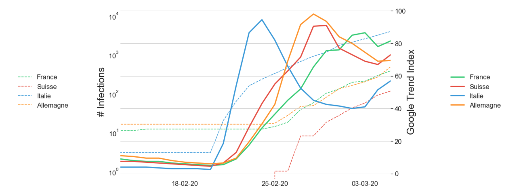
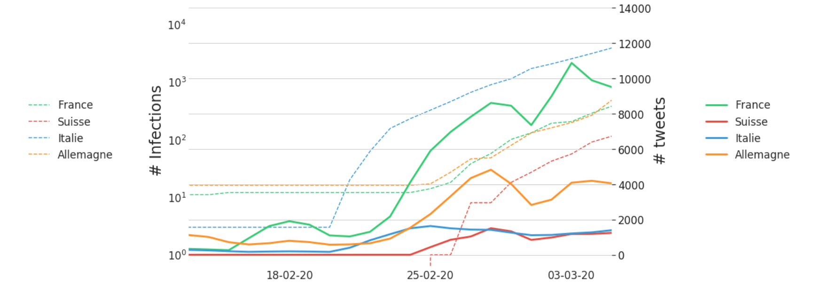
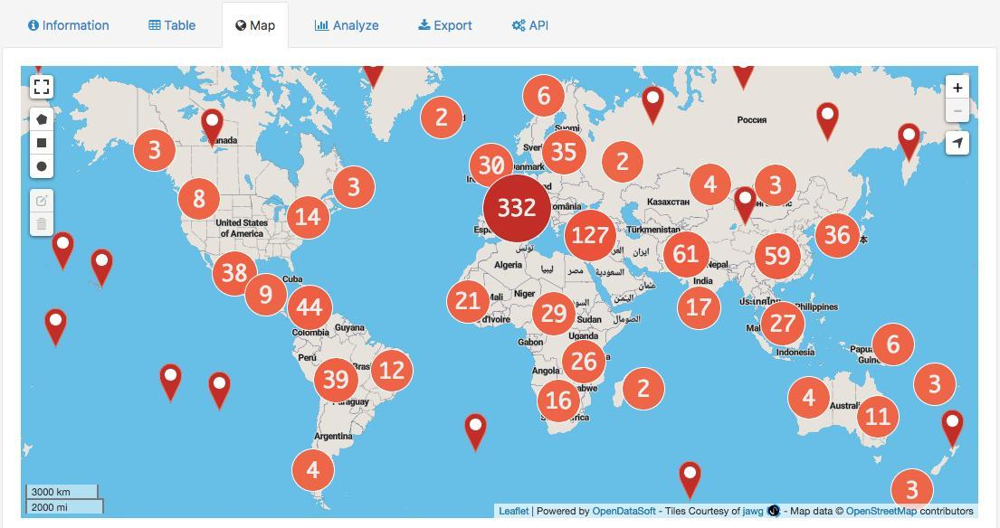

# Project of Data Visualization (COM-480)

| Student's name | SCIPER |
| -------------- | ------ |
| Lucas Strauss | 272432 |
| Anais Ladoy | 216090 |
| François Quellec | 225118 |

[Milestone 1](#milestone-1-friday-3rd-april-5pm) • [Milestone 2](#milestone-2-friday-1st-may-5pm) • [Milestone 3](#milestone-3-thursday-28th-may-5pm)

[Guidelines](https://com-480-data-visualization.github.io/2020-project-guidelines/)

## Milestone 1 (Friday 3rd April, 5pm)

**10% of the final grade**

In this project, we want to link the spread of the COVID-19 pandemic with its information flow on social network and web search.

### Dataset

##### Reported cases of COVID-19
The first dataset that we will use consists of geolocalized reported COVID-19 cases. In December 2019, a research team from John Hopkins University released an interactive web-based dashboard to track COVID-19 in real-time (Dong et al., 2020) using data from various sources. All the data collected and displayed are freely accessible to researchers and public health authorities on Github.

More precisely, we will use the time series daily summary, which is updated once a day and provides information on the number of reported cases, deaths and recoveries associated with Novel Coronavirus. Data are geolocalized using Lat / Lon coordinates at Country / Region level or, if known, Province / State.

CSSE COVID-19 Dataset repository: https://github.com/CSSEGISandData/COVID-19/tree/master/csse_covid_19_data

##### Tweets
To estimate the information flow on social networks, we will use the COVID-19 mentions on Twitter.
Approximately 1/4 of the tweets are geolocalized which allow us to compare the propagation of the virus and the population reaction on social networks.

Twitter api: + dataset twitter (https://github.com/echen102/COVID-19-TweetIDs)

This repository is interesting because it already regroups tweets associated with COVID-19. We "only" have to hydrate them (i.e. from each tweet ID, get the corresponding tweet from the Twitter API).

##### Google searches
Finally the last aspect we want to represent is the number of web searches according to regions.

In order to acquire a dataset on the number of google searches by region in Europe we used [pytrends](https://pypi.org/project/pytrends/) a pseudo API for Google Trend website. The scripts we have made to construct the dataset are in the *scripts/* folder.

Unfornately Google Trend makes accessible only an index representing the popularity of a search (here "Coronavirus") depending on the day and the country concerned, so we will have to adapt the indexes to have a smaller granularity.

### Problematic

As the pandemic spreads around the world and population containment accelerates, social networks and search engines provide a window for people to learn and share about the virus. Mediatization of the pandemic shapes population's reaction to the virus, providing a support to rapidly share good practices about virus prevention but also a support for fake news spreading which could increase population anxiety.

Despite the fact that there are a multitude of interactive maps available on COVID-19, the vast majority only depict the spread of the disease. In our research, we want to relate COVID-19's spatial distribution with population reaction, defined here by the amount of information on both social networks (i.e. Twitter) and search engines (i.e. Google Trend).

Our main hypothesis is that the population response across European countries could be spatially heterogeneous, and not necessarily follow the spread of the pandemic.
Indeed, although all European countries are now affected by the Novel Coronavirus, it can be seen that even neighboring countries have employed different policies to fight the pandemic. Therefore, we could expect different population response too.

The central element of our visualization will be an interactive map, allowing the user to explore the link between the prevalence of the disease and the flow of information on social networks and search engines (i.e. a proxy for the population response in a specific country) as the pandemic spreads. Other visualizations will allow us to complete our analysis, e.g. by allowing the user to have more detailed information for each country.

### Exploratory Data Analysis
As our objective is to study the association between the spread of the pandemic and the flow of information on social network and search engines, we first plotted the correlation between reported cases, tweets, and web searches, for 4 European countries that were early affected by the disease.

##### Google search index versus COVID-19 cases

For Italy, the google search spike coincides perfectly with the outbreak of COVID-19 cases in the country. It is also interesting to note that the countries surrounding Italy are seeing an increase in the number of searches a few days after Italy, which seem to be related to the spread of the virus in Italy and not only in their respective countries.

##### Number of tweets versus COVID-19 cases

With regard to the number of tweets about COVID-19, although trends and uses are different in each country, the fluctuations still seem to be directly related to the spread of the virus in each country.

The two graphs presented above indicates a correlation between the reaction of the population on Twitter and Google, and the geographical evolution of the pandemic. These findings are encouraging us in the desire to explore these variables on an interactive map.

### Related Work
There has already been quite some work on the recent Coronavirus pandemic. The most notable is probably the one on the genetic evolutions of the virus' mutations by the Nextstrain team (https://nextstrain.org/ncov). Some journals have already published some simple infographics such as https://www.ft.com/coronavirus-latest and https://labs.letemps.ch/interactive/2020/carte-coronavirus-monde.

Original approach: Most of the vizualizations found on the internet focus on the medical aspect of the pandemic. Here, we will also study the digital impact of the virus. Adding a spatial dimension to the analysis may also reveal interesting patterns of population reaction to the pandemic.

Inspiration:
A cartogram like visualization could be interesting if not too invasive. A French magazine produced some nice cartograms for the 2012 president election http://archiveweb.epfl.ch/choros.epfl.ch/page-79160-fr.html.

We may add some 3D components to our map, similar to https://pudding.cool/2018/10/city_3d.

#### References  
- Dong, E., Du, H., & Gardner, L. (2020). An interactive web-based dashboard to track COVID-19 in real time. The Lancet Infectious Diseases, S1473309920301201. https://doi.org/10.1016/S1473-3099(20)30120-1

## Milestone 2 (Friday 1st May, 5pm)
**10% of the final grade**

### Sketches of the vizualiation
### Tools and requirements
#### Data acquisition and cleaning
We used Python to acquire and clean up our data.
- **Pandas & Numpy**: To manipulate and clean the data
- **Pytrends**: To aggregate Google Trend data
- **Twarc** : To "hydrate" tweets according to their Ids available on [github](https://github.com/echen102/COVID-19-TweetIDs)
- **Qgis**: To preview our data, make sure it's achievable
#### Viewing data
- **D3.js & JQuery** : The project will mainly be implemented with D3.js. To set up the map, we will first need the courses of week 4 - D3 Basics and week 8 - Maps, we will also rely on the excellent [template](https://www.d3-graph-gallery.com/graph/bubblemap_template.html) by Yan Holtz. As we are working with a lot of data, we may also need the course of week 5 to aggregate and define different types of priorities for our data. We want to represent 3 geocoded variables on a single map, we need to be very careful about the type of color scale we use so that the information is readable, for this the lectures of week 6 could be useful.
- **Bootstrap** : We use Bootstrap to have a nice website quickly but all the visualization part will be done with javascript.
- **FontAwesome** : To have free vector icons
- **ionRangeSlider**: Since we are working with time data, we have set up a slider to change the dates with this library.
- **Chart.js**: We may use this library to draw nice graphics (or just use D3.js, not sure yet).

### Future Goals
- For now the right panels are not working, they always show the same graph. We need to find meaningful information to 
display there per country. 

- We want to add Google Trends data somehow. The thing is that Google Trends data are available per region similarly to
the number of COVID-19 cases which are displayed as the country color. We will experiment different ways of representing
those data. One idea is to add circles with numbers similarly to this .

- We are seduced by the heat map type of visualization. We want to experiment showing the Twitter data with a heat map 
instead of simple points. 

The minimal viable product would be those extensions. And we possible we would like to also implement:

- Currently there is a blank left panel that we might use to display world infection data in order to better identify the context 
especially in relation to the Chinese situation. 

- Because we are dealing with a lot of precise geolocation data our visualization is currently computationally heavy and
takes time to load. We want to aggregate some of it to reduce the loading time because we don't need a degree of precision.

## Milestone 3 (Thursday 28th May, 5pm)
**80% of the final grade**
