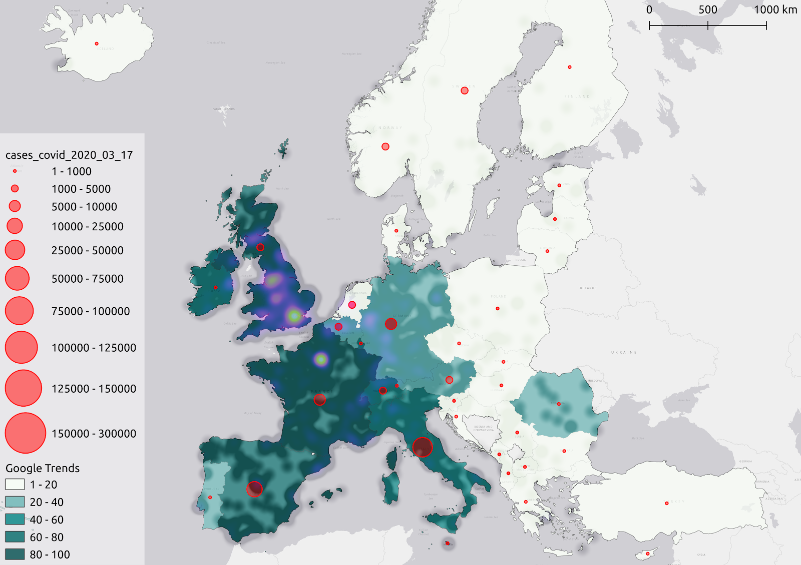
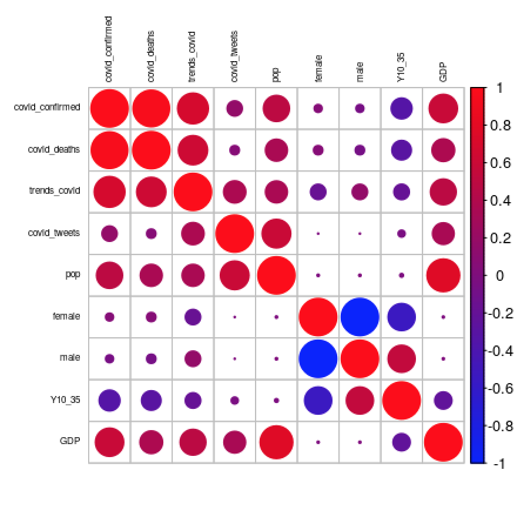
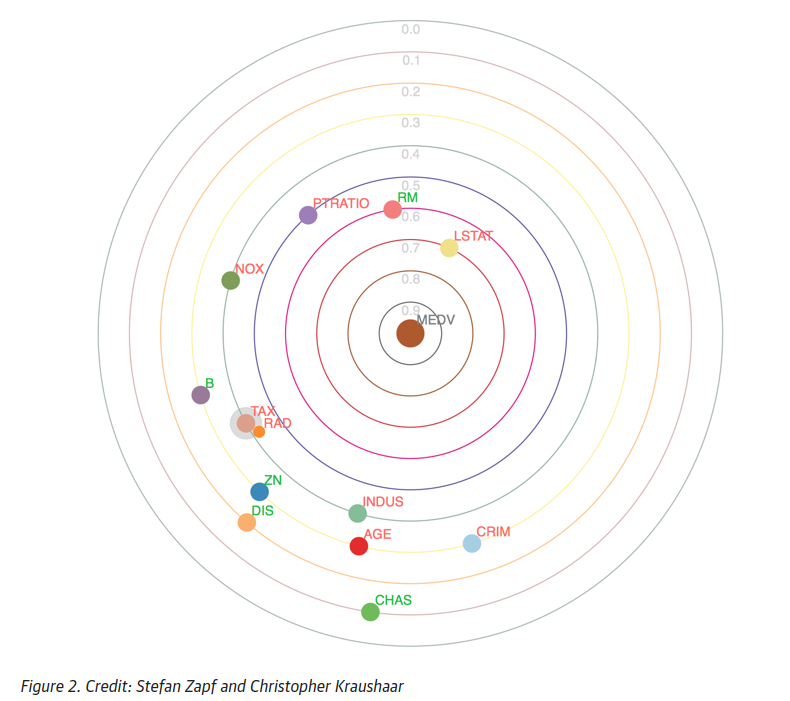

# Project of Data Visualization (COM-480)

| Student's name | SCIPER |
| -------------- | ------ |
| Lucas Strauss | 272432 |
| Anais Ladoy | 216090 |
| François Quellec | 225118 |

[Milestone 1](#milestone-1-friday-3rd-april-5pm) • [Milestone 2](#milestone-2-friday-1st-may-5pm) • [Milestone 3](#milestone-3-thursday-28th-may-5pm)

[Guidelines](https://com-480-data-visualization.github.io/2020-project-guidelines/)

## Milestone 1 (Friday 3rd April, 5pm)

**10% of the final grade**

In this project, we want to link the spread of the COVID-19 pandemic with its information flow on social network and web search.

### Dataset

##### Reported cases of COVID-19
The first dataset that we will use consists of geolocalized reported COVID-19 cases. In December 2019, a research team from John Hopkins University released an interactive web-based dashboard to track COVID-19 in real-time (Dong et al., 2020) using data from various sources. All the data collected and displayed are freely accessible to researchers and public health authorities on Github.

More precisely, we will use the time series daily summary, which is updated once a day and provides information on the number of reported cases, deaths and recoveries associated with Novel Coronavirus. Data are geolocalized using Lat / Lon coordinates at Country / Region level or, if known, Province / State.

CSSE COVID-19 Dataset repository: https://github.com/CSSEGISandData/COVID-19/tree/master/csse_covid_19_data

##### Tweets
To estimate the information flow on social networks, we will use the COVID-19 mentions on Twitter.
Approximately 1/4 of the tweets are geolocalized which allow us to compare the propagation of the virus and the population reaction on social networks.

Twitter api: + dataset twitter (https://github.com/echen102/COVID-19-TweetIDs)

This repository is interesting because it already regroups tweets associated with COVID-19. We "only" have to hydrate them (i.e. from each tweet ID, get the corresponding tweet from the Twitter API).

##### Google searches
Finally the last aspect we want to represent is the number of web searches according to regions.

In order to acquire a dataset on the number of google searches by region in Europe we used [pytrends](https://pypi.org/project/pytrends/) a pseudo API for Google Trend website. The scripts we have made to construct the dataset are in the *scripts/* folder.

Unfornately Google Trend makes accessible only an index representing the popularity of a search (here "Coronavirus") depending on the day and the country concerned, so we will have to adapt the indexes to have a smaller granularity.

### Problematic

As the pandemic spreads around the world and population containment accelerates, social networks and search engines provide a window for people to learn and share about the virus. Mediatization of the pandemic shapes population's reaction to the virus, providing a support to rapidly share good practices about virus prevention but also a support for fake news spreading which could increase population anxiety.

Despite the fact that there are a multitude of interactive maps available on COVID-19, the vast majority only depict the spread of the disease. In our research, we want to relate COVID-19's spatial distribution with population reaction, defined here by the amount of information on both social networks (i.e. Twitter) and search engines (i.e. Google Trend).

Our main hypothesis is that the population response across European countries could be spatially heterogeneous, and not necessarily follow the spread of the pandemic.
Indeed, although all European countries are now affected by the Novel Coronavirus, it can be seen that even neighboring countries have employed different policies to fight the pandemic. Therefore, we could expect different population response too.

The central element of our visualization will be an interactive map, allowing the user to explore the link between the prevalence of the disease and the flow of information on social networks and search engines (i.e. a proxy for the population response in a specific country) as the pandemic spreads. Other visualizations will allow us to complete our analysis, e.g. by allowing the user to have more detailed information for each country.

### Exploratory Data Analysis
As our objective is to study the association between the spread of the pandemic and the flow of information on social network and search engines, we first plotted the correlation between reported cases, tweets, and web searches, for 4 European countries that were early affected by the disease.

##### Google search index versus COVID-19 cases

For Italy, the google search spike coincides perfectly with the outbreak of COVID-19 cases in the country. It is also interesting to note that the countries surrounding Italy are seeing an increase in the number of searches a few days after Italy, which seem to be related to the spread of the virus in Italy and not only in their respective countries.

##### Number of tweets versus COVID-19 cases

With regard to the number of tweets about COVID-19, although trends and uses are different in each country, the fluctuations still seem to be directly related to the spread of the virus in each country.

The two graphs presented above indicates a correlation between the reaction of the population on Twitter and Google, and the geographical evolution of the pandemic. These findings are encouraging us in the desire to explore these variables on an interactive map.

### Related Work
There has already been quite some work on the recent Coronavirus pandemic. The most notable is probably the one on the genetic evolutions of the virus' mutations by the Nextstrain team (https://nextstrain.org/ncov). Some journals have already published some simple infographics such as https://www.ft.com/coronavirus-latest and https://labs.letemps.ch/interactive/2020/carte-coronavirus-monde.

Original approach: Most of the vizualizations found on the internet focus on the medical aspect of the pandemic. Here, we will also study the digital impact of the virus. Adding a spatial dimension to the analysis may also reveal interesting patterns of population reaction to the pandemic.

Inspiration:
A cartogram like visualization could be interesting if not too invasive. A French magazine produced some nice cartograms for the 2012 president election http://archiveweb.epfl.ch/choros.epfl.ch/page-79160-fr.html.

We may add some 3D components to our map, similar to https://pudding.cool/2018/10/city_3d.

#### References  
- Dong, E., Du, H., & Gardner, L. (2020). An interactive web-based dashboard to track COVID-19 in real time. The Lancet Infectious Diseases, S1473309920301201. https://doi.org/10.1016/S1473-3099(20)30120-1

## Milestone 2 (Friday 1st May, 5pm) [pdf version](Milestone_2.pdf)
**10% of the final grade**

The goal of our visualization is to link the spread of the COVID-19 pandemic with its information flow on social network and web search.

You can see what our current website looks like [here](https://com-480-data-visualization.github.io/com-480-project-coronateam/).

In order to visualize the three main information of our project, namely the number of google searches and tweets related to Covid-19 and the reported cases of Covid-19 in the same map and without “overloading” the visualization, we adopted three different visualization that will be overlaid in our dashboard.
An example of the visual rendering of the three visualizations was implemented for a specific day (17/03/20) using the QGIS software (see below). We may change the colors for our final product, especially for the heatmap. Furthermore, the legend corresponding to the heatmap was not added here but we will in our dashboard.

We break this project down into five different fundamental objectives, independent parts to be implemented, which correspond to the minimum viable product. The last piece, "Extra Features", and the part “Extra Idea” in the core goals will be implemented if we have time.

### Static Europe map website
***Variable:*** Geojson to acquire geographic data and construct the map (source: NUTS 2016, Eurostat).

***Implementation:***  D3.js, JQuery, Bootstrap (to have a nice base website quickly).

***Related lectures:*** To set up the map, we will first need the courses of week 4 - D3 Basics and week 8 - Maps-

### Choropleth map of Google searches related to Covid-19 by country and regions
***Variable:*** Google Trends score [0-100] by country and region that we geocoded to a geojson representing administrative borders of European countries (source: NUTS 2016, Eurostat).

***Implementation:*** D3.js, JQuery.

***Related lectures:*** Lecture on Maps (slide 19) and D3 Basics (week 4).

***Extra ideas:*** Maybe try a cartogram representation of the Google Trends index. For now we are using GeoJSON data for the world map so we would have to change to TopoJSON data and try not to mess the entire visualization up.

### Bubble map of Covid-19 reported cases
***Variable:*** Covid-19 reported cases (source: John Hopkins) geocoded at the countries’ centroid. We might add the number of cases at the center of the bubble for completeness similarly to this map.

***Implementation:*** D3.js, JQuery and this excellent template from Yan Holtz. 

***Related lectures:***  Lecture on Maps (slide 19) and D3 Basics (week 4)

***Extra ideas:*** Transform the bubble in a pie chart with the number of confirmed cases and the number of deceased. But the risk is that we cannot distinguish countries with a higher death ratio because numbers are usually around 10%. 

### Geographical heatmap of geolocalized tweets related to Covid-19
***Variable:*** Number of tweets per day geocoded at the exact location (Lat/Lon coordinates).
We will use a geographical heatmap to visualize the density of tweets across Europe by day. Basically, the heat map represents the intensity of points (with dark and high colors representing low and high intensity respectively). It is done using a Kernel Density Estimation interpolation, where we first specify the radius on which we want to interpolate values around each point (in our case, 100km) and the additional weights we want to give to each point (in our case, the number of tweets).

***Implementation:***  D3.js, JQuery, heatmap.js

***Related lectures:*** Lecture on Perception color (slide 20) and Mark and Channels (slide 19) and Maps

### Space-time visualization

***Goal:*** Since we are working with time data, we have set up a slider to change the dates within this time period: 22-01-2020 / 17-03-2020.

***Related tools:*** D3.js, JQuery, ion.RangeSlider.js

***Extra ideas:*** Expand the time period of the study.

### Extra features
- ***Aggregation:*** Because we are dealing with a lot of precise geolocation data our visualization is currently computationally heavy and takes time to load. We could aggregate some of it to reduce the loading time because we don't need a high degree of precision. To achieve this we could make use of the Lecture on Interaction (week 5)
- ***Zoom on countries:*** We also want to allow the user to zoom in on each country to get a more accurate view and also to get more insights about that country through a small toolbox with graphics and other information. 
- ***Basic plot on the right panel:*** For now the right panel is not working, it always show the same graph. We need to find meaningful information to display there per country such as the detailed number of infected and deceased, the daily confirmed case increase, etc…
- ***Basic world informations:*** Currently there is a blank left panel that we might use to display world infection data in order to better identify the context especially in relation to the Chinese situation.
- ***Correlation plot of several covariates by country:*** The central map will allow the user to explore visually the link between Covid-19 cases, tweets and google searches. However, in order to quantify this correlation globally (i.e. for the European countries) and for the entire time period, we could add a plot quantifying the correlation between our three main variables and other covariates specific to the country that could influence the spatial distribution of Covid-19 cases (e.g. total population, GDP) and social network activity (e.g. proportion of young adults, total population). The resulting correlation plot was first implemented in R (see left figure) but we will translate it in d3.js to integrate the results to our final product. As an extra-extra idea we could add some variables and change the correlation plot design by implementing a solar correlation plot with the number of death from Covid-19 at the centre, Figure on the right.

Correlation Map             |  Solar Correlation Map
:-------------------------:|:-------------------------:
  |  

## Milestone 3 (Thursday 28th May, 5pm)
**80% of the final grade**
